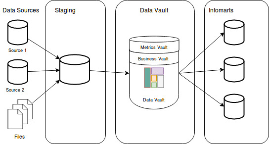
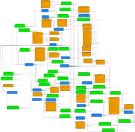

# OSS-Datastore
The goal of this package is to gather data from GitHub via API calls, from both v3 and v4 APIs, and then store said data for further analysis in a data warehouse.

## Goals
GitHub doesn't keep information around indefinitely but for a short amount of time, usually around 14 days worth of data. Because of this, it is difficult to track information around your GitHub organizations (orgs) and repositories (repos) for planning the best place to focus your time/resources. This is exacerbated by the fact that requests to the GitHub APIs are finicky when asking for multiple large sets of data and can get your IP address blocked from making API requests for a period of time.

To get around this, the OSS-Datastore will establish a pipeline for ingesting data from the GitHub APIs, run ETL (extract/transform/load) operations, store data into Redshift using the [data vault modeling](https://en.wikipedia.org/wiki/Data_vault_modeling) technique, and establish a base set of information/data marts for end user analysis and consumption. This modeling technique moves data from multiple sources to a staging area, ETL actions store that data into the data vault, and the data is then spun out into infomarts which are where the end users actually interacts with the data. Below is a really bad diagram to demonstrate the flow of data through the system and will, from a high-level, look like the following.

Items that will be tracked include:

* Stars/forks/watchers
* Repo traffic/stats
* Issue metrics
* Pull request activity
  * New pull requests
  * replies or updates required
* Tracking user (member and external colalborator) access levels
* Security issues in a repo and its dependencies

This isn't the definitive list of information that will be tracked and will expand as the package grows. The tentative data model can be found in 

## Setup
You need to have pipenv installed locally

> `pip install --user pipenv`

To activate shell:

> `pipenv shell`

To install new runtime dependencies

> `pipenv install <package name>`

To install new dev dependencies

> `pipenv install <package name> --dev`

To run, ensure you have copied sample.env to .env or you export the environment variables when running from the command line, fill in the config info, and run

> `pipenv run python datastore.py`

## Note on the Dead Letter Queue
In order to ensure that our data is being pulled and stored from the GitHub API I track and store failed requests in a Dead Letter Queue (DLQ) for manual action. My intention is to attach monitoring to the DLQ and alarm/alert when a new item is added so an admin can investigate why the request failed. Since the reason for the failure can occur for many different reasons I track the infomration about which API version failed, the query/request that failed, and the response body/headers/status code for analysis. From there it is on the admin to take action to ensure the request is retried and the data is successfully stored.

## Development tracker
* [ ] Staging area work
   * [ ] request, locally store, and push files to S3 for the following
     * [X] Repo traffic
     * [X] CVE information
     * [X] Stargazers
     * [X] Watchers
     * [ ] Figure out how to get the remaining in a sane manner[repo information](https://developer.github.com/v4/object/repository/), [team information](https://developer.github.com/v4/object/team/), [user information](https://developer.github.com/v4/object/user/)
     * [ ] Implement sane tracking of remaining data
   * [X] Dead letter queue for failed data requests in PostgreSQL
     * [X] Define schema
     * [X] Store data when requests fail
   * [ ] Cron job to kick-off new data requests
* [ ] Refine data vault model in docs/images/GH_Data_Vault_Layout.jpeg
* [ ] Data warehouse construction via AWS Cloudformation
    * [ ] Define and build the hubs
    * [ ] Define and build the links
    * [ ] Define and build the satellites
    * [ ] Define and build the metrics vault
    * [ ] Define and build the business vault
* [ ] ETL functionality
  * [ ] Staging to dead letter queue
  * [ ] Staging to data vault
  * [ ] Staging to long term storage in Amazon S3
* [ ] Initial data/info mart construction via AWS Cloudformation
  * [ ] Data exploration via Amazon QuickSight

## License
This library is licensed under the [Apache 2.0 License](LICENSE).
